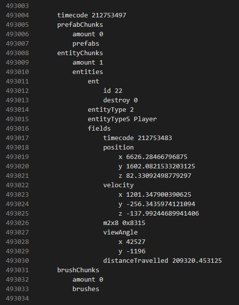

# Donald's Reflex Replay Tools
This is a collection of reverse-engineered specifications regarding Reflex Arena's replay file format, as well as various tools related to replay files. All reverse engineering is based on my analysis of .rep files. All specifications pertain to replay protocol 0x59.

## Moviemaking
`transplant.py` provides moviemakers with the power to change the look of any replay they want! Perfecting the composition of your shots has never been easier, as moviemakers can now freely rearrange the map they're filming to suit their needs. To do so, simply create an edited copy of the map you're filming, record a short replay on that edited copy, and `transplant.py` will create a third replay that combines the edited map data (`donor`) with the camera and player data of the original replay (`recipient`).

## Dumping
`print_replay.py` gives insight into the inner workings of a replay by dumping its contents in a human-readable and convenient text format. 

